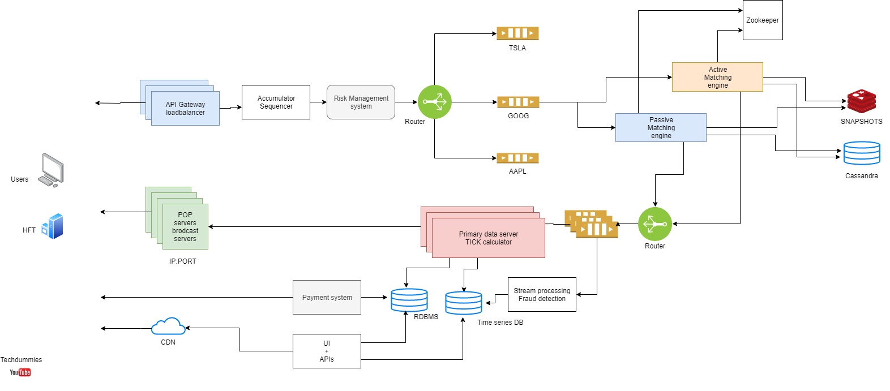

# High-Frequency Trading Model

This project implements a **High-Frequency Trading (HFT)** model designed to analyze and trade stocks with high potential for profit. By combining **machine learning** and **algorithmic trading** techniques, the model is capable of predicting stock price movements and executing trades with low latency.

## 🚀 Technical Overview

### 1. **Model Architecture**
- **Convolutional Neural Network (CNN):**
  - **Purpose:** Predict stock price movements over a 5-minute window.
  - **Structure:** 
    - 4 dense layers with increasing neuron counts.
    - **Activation:** Sigmoid function in the output layer for binary classification.
  - **Pre-trained Weights:** Stored in `model_weights.h5`.

### 2. **Trading Execution**
- **C++ Module:** 
  - **Functionality:** Executes buy/sell orders based on CNN predictions.
  - **Focus:** Optimized for **low-latency** execution.
  - **Input:** Stock ticker symbols.
  - **Output:** Trade decisions for stock exchanges.

### 3. **Data Processing**
- **Data Source:** 
  - Collected historical stock data using **yfinance**.
  - **Preprocessing:** Calculated volatility metrics, which serve as inputs for the CNN model.

---

## 📈 Key System Components

### 1. **Data Ingestion Layer**
- **Multiple data collectors** gather real-time market data from various sources.
- **Message Queue:** Utilizes **Apache Kafka** for handling high-volume, real-time data streams.

### 2. **Processing Layer**
- **Distributed Framework:** Leverages **Apache Spark** for parallel data processing.
- **GPU Clusters:** Accelerate **CNN model inference** for faster predictions.

### 3. **Decision Engine**
- **Load-balanced servers** execute the CNN model.
- **In-memory Cache:** Uses **Redis** to store and access recent predictions rapidly.

### 4. **Execution Layer**
- **C++ Execution Modules** deploy across multiple exchanges to carry out trades.
- **Load Balancer** distributes trading requests for optimal throughput.

### 5. **Monitoring & Logging**
- **Real-time Monitoring:** Powered by **Prometheus** to track system health.
- **Centralized Logging:** Utilizes the **ELK Stack (Elasticsearch, Logstash, Kibana)** for performance tracking and error diagnostics.

### 6. **Backup and Recovery**
- **Redundancy:** Includes backup systems for critical components.
- **Failover Mechanisms** ensure minimal downtime during system failures.

---

## ⚙️ High-Level Architecture for Scalability

The system is designed for scalability with the following components:

- **Data Ingestion:** 
  - Multiple sources for **real-time market data**.
  - **Apache Kafka** handles high-throughput data streams.

- **Processing:** 
  - **Apache Spark** handles data parallelization.
  - **GPU clusters** accelerate model inference, ensuring faster decision-making.

- **Decision Engine:** 
  - **Load balancing** across multiple servers running CNN predictions.
  - **Redis Cache** provides quick access to recent model outputs.

- **Execution:** 
  - **C++ modules** deployed across various exchanges.
  - **Load balancing** ensures optimal trade execution.

- **Monitoring & Logging:** 
  - **Prometheus** provides real-time performance metrics.
  - **ELK Stack** centralizes logs for system tracking.

- **Backup & Recovery:** 
  - Redundant systems for data reliability.
  - **Failover systems** ensure fault tolerance.

---

## 💡 Objective

This architecture aims to:
- **Improve throughput** for large-scale data processing.
- **Reduce latency** in model predictions and trade executions.
- **Enhance system reliability** with robust monitoring and failover systems.

---

## 🔍 Future Enhancements

- **Real-time Model Training:** Implement online learning techniques for continuous model improvement.
- **Enhanced Data Sources:** Integrate additional market data sources such as **Level 2** data, news feeds, and sentiment analysis.
- **Cross-Asset Trading:** Extend the model to handle **multi-asset** trading beyond stocks.

---
